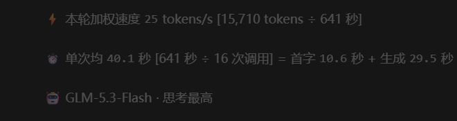

# Z-Badge — ZCode 桌面版「额度 + 速度」仪表盘

> 在 ZCode 桌面应用的聊天工具栏里常驻显示套餐额度徽章，并在每一轮回复末尾生成一张"本轮速度解剖卡"——全部本地计算，不消耗任何模型 token。
>
> **⚠️ 免责声明**：本项目通过修改 ZCode 桌面版安装目录内的 `app.asar`（注入渲染组件、主进程 IPC 通道与 preload 桥）实现功能，需要管理员权限写入安装目录。它不是官方功能，可能与 ZCode 的服务条款存在冲突；应用更新可能导致补丁失效（会安全失败并自动重试）；请自行评估风险。项目提供一键还原与总杀开关，详见证lify「卸载与紧急停用」。

| 工具栏额度徽章 | 回复末尾速度解剖卡 |
|---|---|
|  |  |

---

## 一、这个技能是干嘛的？

一句话：**把 ZCode 的"额度余额"和"模型速度"从黑盒变成常驻可见的仪表盘。**

它由两个协同的技能组成：

| 技能 | 角色 | 一句话说明 |
|---|---|---|
| **model-speed** | 数据层 | 钩子在每轮对话结束时，从本地记录（rollout 日志 + 应用 SQLite）静默计算这一轮的加权速度、首字延迟、耗时构成，写入本地状态文件。不进入对话、模型零参与、零上下文开销 |
| **zbadge** | 展示层 | 向 ZCode 界面注入两组 UI：① 工具栏的三枚额度徽章；② 每轮回复末尾的三行速度卡。带计划任务自动自愈（ZCode 更新后自动重打补丁） |

实际显示效果（示意）：

```
工具栏：  ● 5小时 87%   ● 每周 90%   ● ZCode MCP 100%    ◍  [模型选择 …]

回复末尾：⚡ 本轮加权速度 28 tokens/s [16,886 tokens ÷ 608 秒]
          ⏱ 单次均 46.8 秒 [608 秒 ÷ 13 次调用] = 首字 2.3 秒 + 生成 44.5 秒
          🤖 GLM-5.3-Flash · 思考最高
```

## 二、能让用户做什么？

### 1. 随时看到额度余额
- 工具栏常驻三枚徽章：**5 小时 Prompt 池 / 每周额度 / ZCode MCP** 剩余百分比（体验套餐自动降级为单枚"体验"徽章）；
- 圆点按剩余量分色预警：≥60% 绿 → ≥50% 蓝 → ≥30% 橙 → <30% 红；
- 空间不足自动降档（完整标签 → 紧凑数字 → 隐藏），不遮挡、不换行、不和其它控件打架。

### 2. 每轮对话的完整速度解剖
- **加权速度**：整轮的真实吞吐（Σ输出 token ÷ Σ推理耗时），长调用权重大，最能代表 agent 场景的有效速度；
- **时间构成**：单次平均耗时 = 首字延迟（排队+网络+预填充+思考）+ 纯生成时间——一眼看出时间花在"等"还是"生成"上；
- **模型与思考档位**：本轮主导模型与思考强度（低/中/高/最高）；
- **跨轮对比**：历史各轮的数据永久保留在自己的回复末尾（最近 50 轮 / 7 天），切换模型或思考档位后可直接对比前后差异。

### 3. 免维护的自动运行
- 计划任务每 10 分钟自检：ZCode 升级导致补丁失效时**自动重打**，无需人工干预；
- 全流程验证链（语法门 → 包校验 → 哈希复核），任何一步失败都不会把坏补丁写进应用。

### 4. 可控可撤
- **紧急停用**：技能目录下创建 `DISABLED` 文件 + 重启 ZCode，徽章消失但应用正常；
- **一键还原**：`rollback.ps1` 把应用恢复为打补丁前的原始状态；
- **悬停诊断**：需要排查时可在徽章 tooltip 里看到内部运行状态（默认关闭的构建期开关）。

## 三、使用价值是什么？

1. **额度不再"盲开"**：套餐快耗尽前提前变色预警，避免工作到一半被限额打断；也能发现"额度异常消耗"的轮次（tokens 列直接可见）。
2. **速度从体感变成数字**：换模型、调思考档位（低/中/高/最高）之后，快不快不再靠感觉——上一轮和这一轮的加权速度、首字延迟、生成时间就摆在那里对比。
3. **知道时间花在哪**：首字占比高 = 在等模型"动笔"（预填充+思考）；生成占比高 = 在真输出。这直接决定你的使用策略——简单任务用低档更快更省，复杂推理再上高档。
4. **零额外成本**：所有统计读自本机日志与本地数据库，不发起任何额外模型请求，对对话内容零干扰。

## 四、工作原理（60 秒版）

```
┌─ model-speed（数据层,UserPromptSubmit + Stop 双钩子）─────────────┐
│ 回合结束 → 读 rollout 日志尾部(本轮全部 main 调用)                  │
│          → 读 db.sqlite 的 model_usage 表(首字延迟,按 turnId 关联) │
│          → 计算加权 TPS/首字均/生成均 → 写 speed-history.json      │
│            (每轮一条,≤50 轮/7 天窗;旧轮从 db 自动回填)             │
└──────────────────────────┬───────────────────────────────────────┘
                           ▼
┌─ zbadge(展示层,asar 注入补丁,三处注入点)─────────────────────────┐
│ ① 渲染块:额度徽章 + 速度卡组件(动态锚点定位,零硬编码标识符)        │
│ ② 主进程:ipcMain.handle 只读通道(64KB 上限,只读固定数据文件)      │
│ ③ preload:contextBridge 暴露 window.zbadgeSpeed.read()           │
│ 渲染侧按"回合起点时间 ±5s"把历史条目匹配到各自的回复末尾展示        │
└───────────────────────────────────────────────────────────────────┘
  自动自愈:计划任务 ZbadgeAutoPatch 每 10 分钟校验 → 失效即重打
```

安全设计：

- 注入组件带 **React 错误边界** + 全路径 try/catch——组件任何异常只损失徽章，不影响应用；
- **总杀开关**：技能目录创建 `DISABLED` 文件即全线停用；
- **自注销**：自动化入口（trampoline）独立于技能目录存放，技能被删时自动注销计划任务，零弹窗；
- **回滚基线**：每次打补丁前自动刷新原始 asar 快照，`rollback.ps1` 一键还原；
- **验证链**：每个被修改的文件都过语法门，打包后做文件数/清单校验，写入后做哈希复核——不过即中止。

## 五、环境要求

| 项 | 要求 |
|---|---|
| 操作系统 | Windows 10/11（计划任务、UAC 提权、VBS 均为 Windows 机制） |
| ZCode 桌面版 | 已实测：2026-09 版本。其它版本锚点可能失效（会安全失败，详见「已知限制」） |
| Node.js | ≥ 22.5（需要内置 `node:sqlite`；未满足时速度卡的 TTFT 段自动降级） |
| 权限 | 安装/自愈需管理员（计划任务以最高权限注册，日常运行免 UAC） |
| 磁盘 | 工作目录约 600MB 临时空间（asar 解包/打包产物，可随时删除，自动重建） |

## 六、安装（3 步）

```powershell
# 1. 克隆仓库
git clone https://github.com/PassCode023/Z_Badge.git
cd Z_Badge

# 2. 复制技能到 ZCode 的技能目录(普通权限)
powershell -ExecutionPolicy Bypass -File .\install.ps1

# 3. 完全退出 ZCode(含托盘图标)再启动,然后对 ZCode 说:
#    「安装 zbadge」
```

第 3 步 agent 会按技能说明书自动完成：首次打补丁（弹一次 UAC）→ 注册自愈计划任务 → 提示你再次重启 ZCode。此后无需任何人工维护。

<details>
<summary>安装目标不在默认位置？（自定义安装目录）</summary>

设置环境变量后重跑打补丁流程（或重启后再对 agent 说一次「修复 zbadge」）：

```powershell
[Environment]::SetEnvironmentVariable('ZCODE_INSTALL_DIR', '你的ZCode安装目录', 'User')
```

支持自动探测的默认位置：`C:/Program Files/ZCode`、`D:/Program Files/ZCode`、`E:/Program Files/ZCode`、`%LOCALAPPDATA%/Programs/ZCode`。
</details>

## 七、日常使用

- **什么都不用做**：额度徽章常驻；每轮回复结束后速度卡自动出现；ZCode 升级后 10 分钟内自动恢复。
- **对 agent 说的话**（技能触发词）：
  - 「看一下 zbadge 状态」→ 检查补丁/任务/数据健康度；
  - 「修复 zbadge」→ 强制重打补丁；
  - 「卸载 zbadge」→ 完整卸载（见下）。
- **手动命令**（可选，PowerShell）：

```powershell
cd $env:USERPROFILE\.agents\skills\zbadge\scripts
node check.js          # 状态体检(补丁哈希/进程时效)
node auto-repatch.js --status   # 补丁状态
# 强制重打(免 UAC):创建 work\FORCE 文件后等 10 分钟周期,或对 agent 说「修复 zbadge」
```

## 八、卸载与紧急停用

| 场景 | 操作 |
|---|---|
| **临时隐藏徽章**（保留自愈能力之外的一切） | 技能目录创建空文件 `DISABLED` + 重启 ZCode；删除该文件即恢复 |
| **完整卸载** | 对 agent 说「卸载 zbadge」，它会：提权跑 `rollback.ps1` 还原 asar → 删除计划任务 → 清理 hooks 中本技能条目（不动其它钩子）→ 可删技能目录 |
| **手动还原** | 提权 PowerShell 运行 `skills\zbadge\scripts\rollback.ps1`（使用打补丁前自动保存的原始 asar 快照） |

## 九、已知限制与故障排查

1. **ZCode 更新可能使补丁失效**：补丁通过"动态锚点"定位注入点（不硬编码压缩变量名），小版本更新通常无感自愈；但若应用重构了相关界面结构，锚点找不到会**安全失败**（不写入任何内容），计划任务每 10 分钟重试。此时需要等本项目更新锚点规则——欢迎提 issue 并附上 `work/auto-repatch.log` 尾部。
2. **仅支持 Windows**：macOS/Linux 用户无法使用计划任务与 UAC 机制（欢迎 PR）。
3. **速度卡不出现**：按顺序检查——`skills\zbadge\work\state.json` 是否存在（无 = 补丁未打上）→ `~/.zcode/zbadge/speed-history.json` 是否有数据（无 = 钩子未生效，确认已重启过 ZCode）→ 回合是否已完成（进行中的回合不显示）。
4. **数字口径**：耗时只含模型调用（思考+生成），不含工具执行等待，与界面"已工作"的墙钟时间不同属正常；首字延迟包含思考档位的思考时间（GLM 系列在动笔前思考）。
5. **隐私**：所有数据只读自本机（rollout/SQLite），只写本机（`~/.zcode/zbadge/`），无任何网络请求。

## 十、项目结构

```
skills/
  zbadge/            展示层技能(注入补丁 + 自愈自动化)
    SKILL.md           agent 说明书(安装/运维/卸载的执行手册)
    scripts/
      patch.js           动态锚点发现与注入(渲染/主进程/preload 三处)
      auto-repatch.js    一条龙:提取→逆转→基线→注入→校验→打包→应用
      check.js           状态体检
      apply.ps1          提权写入(哈希复核)
      rollback.ps1       一键还原
      verify-pack.js     打包完整性校验
      install-autopatch-task.ps1  注册自愈计划任务(自动生成 trampoline)
      run-elevated.ps1   UAC 提权桥
      hook-session-start.js  会话启动钩子(状态提示)
  model-speed/       数据层技能(测速钩子 + 报表)
    SKILL.md
    scripts/
      turn-stats.mjs     每轮测速钩子(Stop 主 + UserPromptSubmit 兜底)
      install.mjs        钩子安装器(幂等)
      zcode-speed.mjs    历史统计/受控基准报表
```

## 十一、许可证

[MIT](LICENSE) — 按"现状"提供。修改 ZCode 应用文件的风险由使用者自行承担。

---

**给本项目的维护者**：ZCode 大版本更新后，若 issue 反映"补丁失效"，按 `work/auto-repatch.log` 的 FATAL 信息更新 `patch.js` 中的锚点字面量即可；锚点断言全部是"计数≠1 即拒打"，不存在盲打风险。
